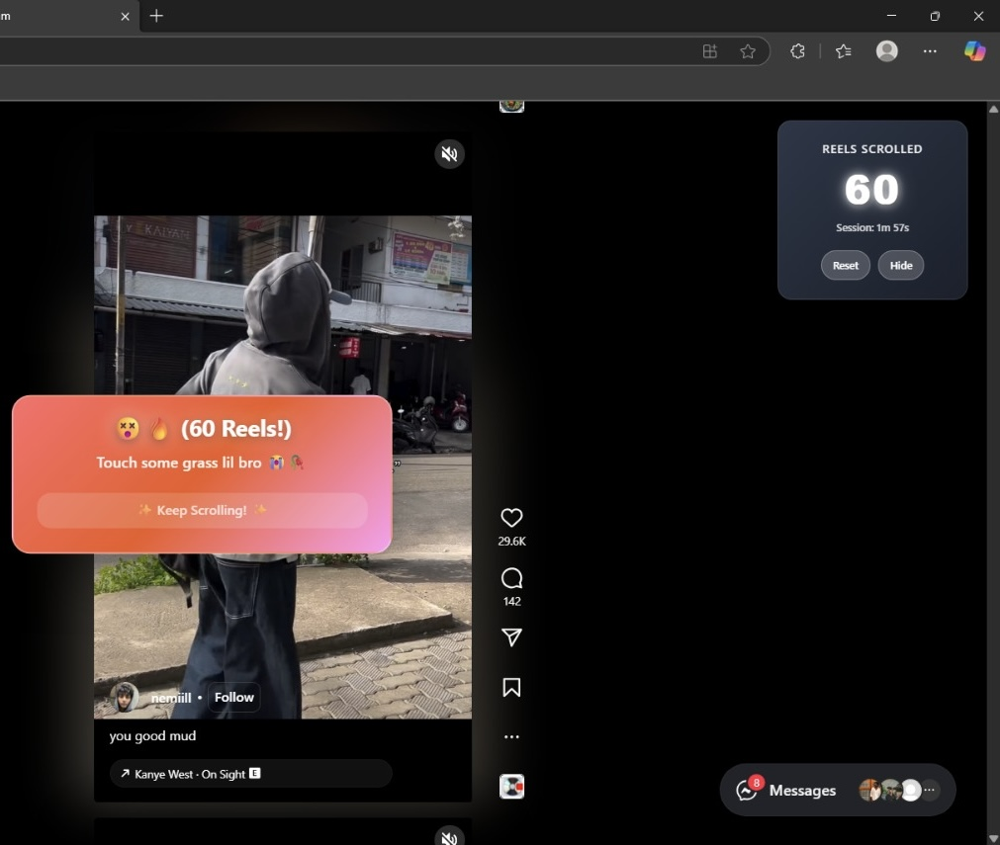
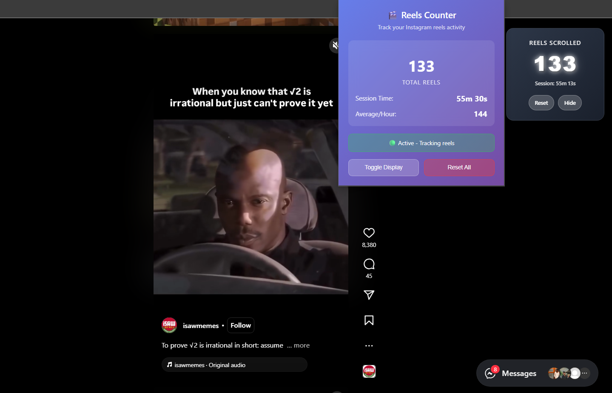
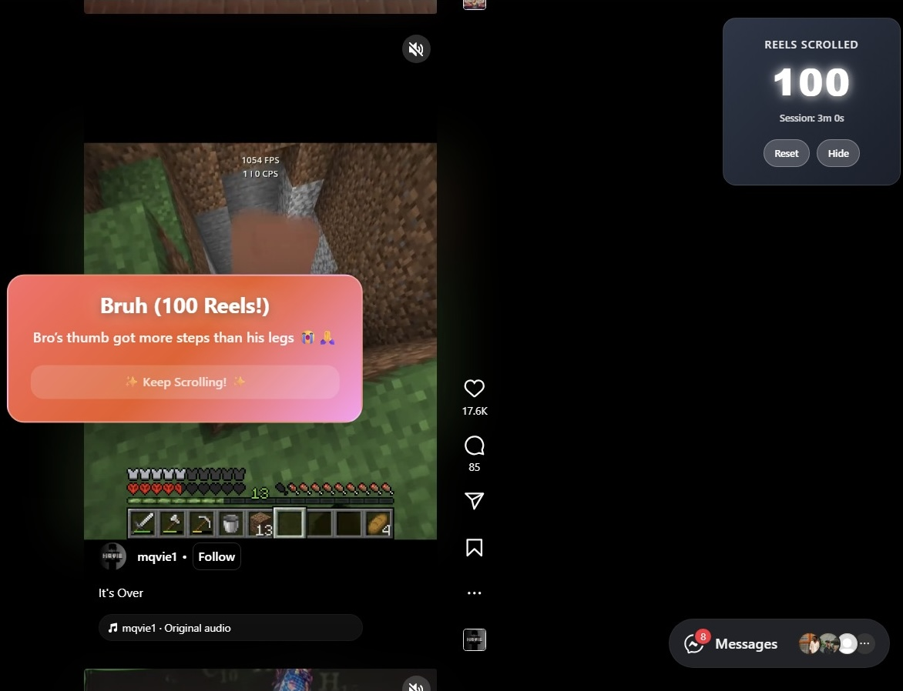

# Reels Counter🎬

## Basic Details
### Team Name: Phantom Oreo🚀

### Team Members
- Team Lead: Pranav Pradeep - College of Engineering,Thalassery
- Member 2: Sourav K - College of Engineering Thalassery

### Project Description
This project tracks the number of instagram reels or short videos a user watches within an application and displays a subtle notification when a certain number of videos is reached. The goal is to encourage users to take breaks and maintain healthy screen time habits.

### The Problem (that doesn't exist)
We all know how easy it is to “just watch one more” and suddenly an hour’s gone. Most people don’t even realize how much time they spend scrolling, and there’s usually nothing to remind them to stop.

### The Solution (that nobody asked for)
This app quietly counts your reels in the background and, when you’ve hit a set milestone, pops up a message suggesting you put the phone down for a bit. It’s a small reminder to help you not go overboard with a little bit of sarcasm.

## Technical Details
### Technologies/Components Used
For Software:
- Languages used: JavaScript, HTML, CSS, Python (for icon generation script)
- Frameworks used: None (uses native WebExtension/Chrome Extension APIs)
- Libraries used: None external — only built-in browser APIs (storage, activeTab)
- Tools used: VS Code , Warp AI (built-in AI coding assistant) , Command-line interface (CLI) , Git (for version control)

For Hardware:
- Main components: Desktop/laptop with a modern browser
- Specifications: Supports Chrome, Edge, Brave, or any Chromium browser with Extension Manifest V3 support
- Tools required: Internet connection for Instagram access

### Implementation
For Software:
- Manifest Configuration: Defines permissions (activeTab, storage) and sets up the extension to run on instagram.com.
- Content Script (content.js): Injected into Instagram to detect reel scrolling and update the counter.
- Storage API: Saves and retrieves the current reel count.
- Popup UI (popup.html, popup.js): Displays the counter and allows interaction from the extension icon.
- CSS Styling (styles.css): Styles the popup interface.
- Icons: Provided in PNG and SVG formats, with a Python script (create-icons.py) to generate them.
  
# Installation
1. Download or clone the project repository from GitHub.  
2. Open your browser and navigate to the Extensions page  
   (e.g., `chrome://extensions/` for Chrome/Brave, `edge://extensions/` for Edge).  
3. Enable **Developer mode** from the top-right corner of the page.  
4. Click on **Load unpacked**.  
5. Select the `Reel Counter` folder from the downloaded project files.  
6. The extension will now appear in your browser’s extension list and is ready to use.  

# Run
Once installed:  
1. Open Instagram in your browser.  
2. Start watching reels.  
3. The extension will track the number of reels scrolled and display it in the popup UI.  

### Project Documentation
For Software:
- manifest.json → Defines extension metadata, permissions, icons, and popup.
- content.js → Main logic for detecting reel scroll events and updating the counter.
- popup.html / popup.js → User interface displayed when the extension icon is clicked.
- styles.css → Styles for popup elements.
- create-icons.py → Optional helper script for generating icon sizes.
- INSTALL.md → Step-by-step installation instructions.
- TESTING.md → Testing process and verification steps.

# Screenshots (Add at least 3)
  
*This shows when the user scrolls 60 reels.*
  
*This screenshot displays the extension popup UI tracking the number of reels watched.*
  
*This shows when the user scrolls till 100 reels.*

# Diagrams
  
*This diagram shows the overall workflow and architecture of the project.*

# Build Photos

*List out all components shown*

*Explain the build steps*

*Explain the final build*

### Project Demo
# Video
[Demo Video Link](https://drive.google.com/drive/folders/1i9bM-rhi_Bx-PcBEeBZ5E7OtD7UsWidb?usp=sharing)
*This video demonstrates the working of the extension*

## Team Contributions
- [Name 1]: [Specific contributions]
- [Name 2]: [Specific contributions]
- [Name 3]: [Specific contributions]

---
Made with ❤️ at TinkerHub Useless Projects 

